<div align="center">

# Stash

Design assets and inspiration for your next build

[![Live][badge-site]][url-site]
[![HTML5][badge-html]][url-html]
[![CSS3][badge-css]][url-css]
[![JavaScript][badge-js]][url-js]
[![Claude Code][badge-claude]][url-claude]
[![License][badge-license]](LICENSE)

[badge-site]:    https://img.shields.io/badge/live_site-0063e5?style=for-the-badge&logo=googlechrome&logoColor=white
[badge-html]:    https://img.shields.io/badge/HTML5-E34F26?style=for-the-badge&logo=html5&logoColor=white
[badge-css]:     https://img.shields.io/badge/CSS3-1572B6?style=for-the-badge&logo=css3&logoColor=white
[badge-js]:      https://img.shields.io/badge/JavaScript-F7DF1E?style=for-the-badge&logo=javascript&logoColor=black
[badge-claude]:  https://img.shields.io/badge/Claude_Code-CC785C?style=for-the-badge&logo=anthropic&logoColor=white
[badge-license]: https://img.shields.io/badge/license-MIT-404040?style=for-the-badge

[url-site]:   https://stash.neorgon.com/
[url-html]:   #
[url-css]:    #
[url-js]:     #
[url-claude]: https://claude.ai/code

</div>

---

## Overview

Stash collects assets and references worth reaching for on a future build: icon sets, UI kits,
pixel art, royalty-free music, and reading that changes how you work. Every entry says what you
would use it for, what it costs, and nothing more, because nothing here has been judged yet.

That is the whole difference from [Awesome Sites](https://awesomesites.neorgon.com/), which is a
list of tools that have been tried and rated. This one is the shelf you raid when a project starts.
Anyone can add a find, and the catalog doubles as a JSON API so an assistant can look up a real
icon set instead of reaching for an emoji.

**Live:** stash.neorgon.com

---

## Features

- **Six shelves** -- Icons, UI Elements, UI Inspiration, Pixel Art, Music & Sound, and Reading, each with its own accent and blurb
- **Open submissions** -- anyone can add a find with no account; it lands on the Fresh drops shelf immediately and joins a shelf once reviewed
- **Want-to-use votes** -- mark what you would actually reach for, so the shelf sorts itself over time
- **Search and filters** -- full-text search across names, reasons and tags, stacked with price tier and tag filters
- **Agent-ready JSON API** -- `api/v1/` serves the whole catalog and one file per shelf, with per-section hints telling an assistant how to use it
- **Copy for AI** -- one button copies a prompt-ready digest of every source into the clipboard
- **Keyboard driven** -- `/` focuses search, `n` opens the submit form, `Esc` closes anything open

---

## The submission loop

```
someone submits  ->  Fresh drops shelf (live, public)  ->  curator approves
                                                              |
                        data/entries.json  <--  npm run sync  <+
                                |
                          make api  ->  api/v1/*.json  ->  shelves and agents
```

Submissions live in Convex so they appear the moment someone adds one. The curated shelves live in
committed JSON so they load fast, survive the backend being down, and can be reviewed in a diff.

Moderation is unlocked by visiting `#curate` and entering the curator passphrase, which is checked
against a bcrypt hash held in the Convex environment. The passphrase stays in memory for that tab
only, so nothing privileged is ever written to browser storage.

---

## Running locally

ES modules require an HTTP server (not `file://`):

```bash
make serve        # http://localhost:8857
```

Rebuild the static API after editing anything in `data/`:

```bash
make api          # validates data/, then writes api/v1/
```

The live layer (submissions and votes) needs Convex:

```bash
npm install
make convex                                    # npx convex dev
make hash                                      # generate the curator hash
npx convex env set CURATOR_PASSWORD_HASH '...' # paste the hash it prints
```

Then set `CONVEX_URL` in `js/config.js` to the deployment URL. While it is empty the site still
works: shelves render from the static API and "Add a find" opens a prefilled GitHub issue instead.

Pull approved submissions into the catalog:

```bash
CONVEX_URL=https://x.convex.cloud STASH_CURATOR_PASSWORD='...' npm run sync
```

---

## JSON API

| Endpoint | Contents |
|---|---|
| `api/v1/catalog.json` | Every section and entry, plus hub and agent metadata |
| `api/v1/sections.json` | Section index with blurbs and agent hints |
| `api/v1/sections/{id}.json` | One shelf, for a smaller payload |

Section ids: `icons`, `ui-elements`, `ui-inspiration`, `pixel-art`, `music`, `reading`.

---

## Architecture



```
stash-site/
├── index.html                  # App shell
├── data/
│   ├── sections.json           # The six shelves (source of truth)
│   └── entries.json            # Curated entries (source of truth)
├── api/v1/                     # Generated by make api, committed
├── scripts/
│   ├── build-api.mjs           # data/ -> api/v1/, validates first
│   ├── sync-approved.mjs       # Convex approved rows -> data/entries.json
│   └── hash-passphrase.mjs     # bcrypt hash for the curator passphrase
├── css/style.css               # Tokens + components (header/footer kits vendored)
├── js/
│   ├── app.js                  # Entry point
│   ├── config.js               # Convex URL, repo, endpoints
│   ├── state.js                # Shelf, filters, visitor id, curator session
│   ├── data.js                 # Static catalog + Convex layer
│   ├── filters.js              # Search, filtering, sorting, grouping
│   ├── render.js               # Shelves, cards, agent digest
│   ├── events.js               # Clicks, keyboard, votes, review
│   ├── submit.js               # Add a find, curator unlock
│   ├── modal.js                # Modal open/close/escape
│   └── utils.js                # Escaping, URL safety, toast, visitor id
└── convex/                     # Backend (see below)
```

### Backend

```
convex/
├── schema.ts                   # submissions, votes, curatorAttempts
├── submissions.ts              # submit (validated, rate limited), listPending
├── votes.ts                    # toggle, summary
├── moderation.ts               # internal lockout guard
├── admin.ts                    # "use node": bcrypt passphrase check
└── lib/validate.ts             # URL and text validation shared by mutations
```

Submissions are unauthenticated by design, so every field is cleaned server-side, links are
restricted to `http(s)`, duplicates are rejected, and each browser is capped at 5 submissions per
hour. Five wrong passphrases lock moderation for 15 minutes.

---

<div align="center">
<sub>Part of <a href="https://neorgon.com/">Neorgon</a></sub>
</div>
